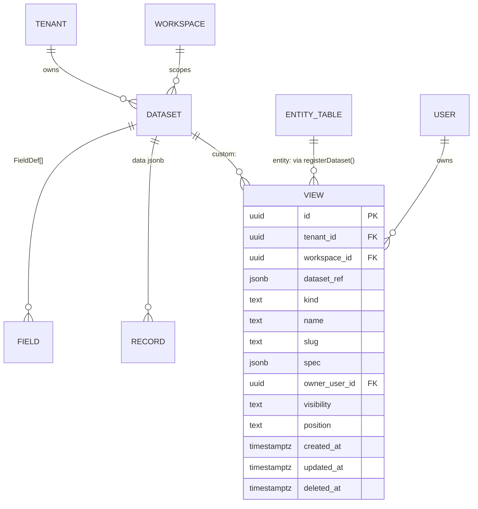

# View model: `ViewSpec`, `FieldDef`, `DatasetRef`

Status: v3, 2026-09-19. Owner: tables (Nova); spec by Quill (PAP-161), decision in
[ADR 0016](../adr/0016-view-model.md). Code: `packages/views/src/model/`, registry port
`packages/views/src/registry/`, generated JSON Schema `packages/views/schema/`, golden fixtures
`packages/views/fixtures/`. Every PaperOS view (grid, kanban, calendar, timeline, gantt, gallery,
list, form, map, chart) renders from one `ViewSpec`; the compiler (PAP-163), the renderer registry
(PAP-614), dashboards (PAP-173), the page spec's inline views (PAP-119) and the API consume the same
type. Other modules import it through `@paperos/contract-tables` (PAP-483), never from this package.

The equivalence columns name what each benchmark product calls the property; "—" means the product
has no equivalent, which is the superset claim this model makes. The parity audit behind the
columns is [`docs/research/views-parity-checklist.md`](../research/views-parity-checklist.md)
(PAP-162).

## 1. Data source: `DatasetRef`

A view renders rows of exactly one dataset. Two sources exist:

| Form | Object | String key | Where the fields and rows live |
| -- | -- | -- | -- |
| Entity (code) dataset | `{ kind: 'entity', key }` | `entity:<slug>` | A Drizzle table another module registered with `registerDataset()`; `FieldDef[]` in code; rows in that table, RLS from PAP-34. |
| Custom dataset | `{ kind: 'custom', datasetId }` | `custom:<uuidv7>` | `dataset` row; `FieldDef[]` in `field`; rows in `record.data jsonb` (max **500** fields, **100 KB** per row: `DATASET_LIMITS`). |

`ViewSpec.datasetRef` and the `view.dataset_ref jsonb` column store the object form; the string key
is used in indexes, URLs, `EntityRef.type` and comment anchors. `formatDatasetRef`,
`parseDatasetRef` and `datasetRefKeySchema` convert; `sameDatasetRef` compares. A slug is
`^[a-z][a-z0-9_]{0,63}$`.

| PaperOS | Airtable | Notion | ClickUp |
| -- | -- | -- | -- |
| `entity:<key>` | — (every table is a base table) | — (linked database of a built-in) | Space / Folder / List (tasks only) |
| `custom:<id>` | Table | Database | List with custom fields |

### 1.1 Registry port

```ts
registerDataset({ key: 'memberships', table: membership, fields, defaultSort, rls: true });
getDataset('entity:memberships');           // DatasetDefinition | undefined
datasetRegistry.resolve({ kind: 'custom', datasetId }); // throws NOT_FOUND
```

`DatasetRegistryPort` has `register`, `registerCustom`, `get`, `resolve`, `has`, `list`,
`unregister`, `clear`. `createDatasetRegistry()` makes an isolated instance (one per kernel, one per
test); the module-level `datasetRegistry` is the default until PAP-489 binds the DI token. The
`table` is opaque (`unknown`): this package never imports Drizzle, so contracts and the browser can
import it. `toEntityRef(ref, recordId)` derives the `EntityRef` comments, notifications, search and
audit store (`type` is the dataset key for entity datasets).

## 2. Fields: `FieldDef`

| Property | Type | Meaning | Airtable | Notion | ClickUp |
| -- | -- | -- | -- | -- | -- |
| `id` | string 1-64 | Stable id `ViewSpec` references. UUIDv7 (`field.id`) for custom datasets; the field key for code datasets. | field id `fld…` | property id | custom field id |
| `key` | slug | `record.data[key]`, formulas, API. Unique per dataset. | — (name is the key) | — | — |
| `name` | 1-120 | Display name (user data, translatable per tenant). | name | name | name |
| `type` | `FieldType` | One of 31 closed names (§2.1). | field type | property type | field type |
| `options` | record | Per-type options, validated by the type's `optionsSchema` (PAP-164). Default `{}`. | type options | property config | type config |
| `required` | bool, default false | Server and form validation. | — | — | required (forms) |
| `unique` | bool, default false | Unique per dataset (server-enforced). | — | — | — |
| `hidden` | bool, default false | Never projected; not even to public views. | hidden field (per view) | hidden property | hidden field |
| `computed` | bool, default false | Derived; never editable. **Must** be `true` for lookup, rollup, formula and the system fields. | formula / lookup / rollup | formula / rollup | formula |
| `description?` | ≤500 | Header tooltip and form help (round 4). | field description | property description | field description |
| `group?` | 1-64 | `FieldGroup` on the record page and forms (round 4; PAP-333, PAP-667). | — | — | — |
| `defaultValue?` | reserved | Static value or dynamic token; shape owned by PAP-628. | default value (some types) | — | default value |
| `permissions?` | reserved | Per-audience read / write; shape owned by PAP-638. | field editing permissions | — | custom field permissions |

`fieldDefsSchema` validates a dataset's list: at most 500 entries, unique `id`, unique `key`.

### 2.1 `FieldType`

The enum is closed on purpose: adding a value later is a breaking change for consumers that
switch on it (module-system §2.1), so every type an accepted issue names is reserved now. Runtime
behaviour (`defineFieldType`) lands per owner; until then the field registry reports the type as
"not wired yet" in dev mode.

| Type | Owner | Airtable | Notion | ClickUp |
| -- | -- | -- | -- | -- |
| `text`, `longText` | PAP-338 | Single line text, Long text | Text | Text, Text area |
| `number`, `currency`, `percent` | PAP-338 | Number, Currency, Percent | Number (formats) | Number, Money, Progress (manual) |
| `date` | PAP-338 | Date | Date | Date |
| `checkbox` | PAP-338 | Checkbox | Checkbox | Checkbox |
| `rating` | PAP-338 | Rating | — | Rating |
| `url`, `email`, `phone` | PAP-338 | URL, Email, Phone | URL, Email, Phone | Website, Email, Phone |
| `select`, `multiSelect` | PAP-339 | Single select, Multiple select | Select, Multi-select, Status (`options.kind: 'status'`) | Dropdown, Labels |
| `user` | PAP-339 | User / Collaborator | Person | People |
| `attachment` | PAP-339 | Attachment | Files & media | Files |
| `relation`, `lookup`, `rollup` | PAP-340 | Link to another record, Lookup, Rollup | Relation, Rollup | Relationship, Rollup |
| `formula` | PAP-340 (engine PAP-171) | Formula | Formula | Formula |
| `geo` | PAP-622 | — | — | Location |
| `button` | PAP-388 | Button | Button | — |
| `autonumber`, `createdTime`, `lastModifiedTime`, `createdBy`, `lastModifiedBy` | PAP-616 | Autonumber, Created time, Last modified time, Created by, Last modified by | Created time, Last edited time, Created by, Last edited by, ID | Task ID, Date created, Date updated, Created by |
| `richText` | PAP-627 | — (rich text option) | Text (rich) | Text area (rich) |
| `duration`, `time` | PAP-627 | Duration | — | Time estimate |
| `progress` | PAP-627 | — | — | Progress (auto) |
| `json` | PAP-627 | — | — | — |

`COMPUTED_FIELD_TYPES` and `MULTI_VALUE_FIELD_TYPES` are exported for the compiler and the group
editor; `FIELD_TYPE_OWNERS` is the table above as data.

## 3. `ViewSpec`

`viewSpecSchema` is a discriminated union on `kind`: ten members, one shared base, each member the
base plus that kind's named `options` schema. Every object is `.strict()`. `VIEW_SPEC_VERSION` is
`3`. `ViewSpec` is the parsed type (defaults applied), `ViewSpecInput` what a writer may send,
`ViewSpecOf<'kanban'>` the narrowed member.

| Property | Type | Rules | Airtable | Notion | ClickUp |
| -- | -- | -- | -- | -- | -- |
| `id` | UUIDv7 | `view.id`. | view id `viw…` | view id | view id |
| `version` | `3` | Current only; older specs go through `migrateViewSpec` (§5). | — | — | — |
| `kind` | `ViewKind` | §4. | view type | layout | view type |
| `datasetRef` | `DatasetRef` | §1. | table | data source | list / location |
| `name` | 1-120 | Duplicates allowed; uniqueness is on the row (`view` table slug). | view name | view name | view name |
| `description?` | ≤2000 | Shown in the view switcher. | view description | — | view description |
| `fields[]` | `ViewField` ≤500 | Projection: `{ fieldId, width?, visible (default true), order, frozen? }`. `fieldId` unique. | visible / hidden fields, widths, frozen columns | property visibility and order | column visibility, width, pinned |
| `filter?` | `FilterTree` | Absent = no filter. From `@paperos/core/filter` (PAP-279): nested groups, `{ $var: 'principal.id' }`, relative dates. **`unknown` until PAP-279 lands.** | filter groups | filter groups | filters |
| `sorts[]` | `Sort` ≤5 | `{ fieldId, direction, nulls? }`. | sorts (unlimited) | sorts | sorts (≤2) |
| `groups[]` | `Group` ≤3 | `{ fieldId, direction, expandMulti, collapsed, dateBucket?, hideEmpty }`. Multi-value fields: `expandMulti: false` groups by the value combination (one row per record), `true` one row per value. | group (≤3) | group / sub-group (≤2) | group by (1) |
| `aggregations[]` | `Aggregation` ≤100 | `{ fieldId, fn, label?, scope: footer\|group\|both }`. `fn` in §3.1. | summary bar | calculations | column totals |
| `rowHeight` | `short\|medium\|tall\|extraTall` | Default `short`. | row height | — | — |
| `options` | per kind | §4. Named schema per kind. | view settings | layout settings | view settings |
| `search?` | `{ query, fieldIds? }` | Saved toolbar search. | search (unsaved) | search (unsaved) | search (unsaved) |
| `visibility` | `personal\|shared\|public` | `public` requires `sharing`. | personal / collaborative / locked views; shared view link | private / shared; publish | personal / everyone; public sharing |
| `ownerUserId` | UUID | `user.id` (global user, any UUID version). | creator | — | creator |
| `permissions` | `{ canEditRecords: AudienceId[], canEditView: AudienceId[] }` | Resolved by `can()` (PAP-59). On an RLS dataset these lists **only narrow**, never widen. | view permissions (editors) | — | view permissions |
| `sharing?` | `ViewSharing` | `{ publicFieldIds?, allowExport, allowEmbed, allowCopy, allowViewerFilters }`. Tokens, passwords and expiry live in `view_share` (PAP-624). Hidden fields never leak even when listed. | shared view options | publish options | public sharing options |
| `locked` | bool, default false | Spec edits limited to `permissions.canEditView`. | locked view | lock database | protected view |
| `formats?` | reserved | Conditional formatting rules; shape owned by PAP-626. | coloring | — | — |
| `colorBy?` | reserved | Record colouring source; shape owned by PAP-626. | color by select field | — | — |

### 3.1 `AggregateFn`

`count`, `countEmpty`, `countFilled`, `countUnique`, `percentEmpty`, `percentFilled`,
`percentUnique`, `sum`, `avg`, `median`, `min`, `max`, `range`, `stdDev`, `earliest`, `latest`,
`dateRangeDays`, `checked`, `unchecked`, `percentChecked`, `concat`. Which functions a field type
allows is declared by the type (`aggregations` in `defineFieldType`, PAP-164); the compiler
(PAP-336) rejects a mismatch at compile time, not here.

| PaperOS | Airtable summary bar | Notion calculation | ClickUp |
| -- | -- | -- | -- |
| `count` / `countFilled` / `countEmpty` / `countUnique` | none, filled, empty, unique | count all, count values, count empty, count not empty, count unique | count |
| `percentEmpty` / `percentFilled` / `percentUnique` | percent empty, percent filled, percent unique | percent empty, percent not empty | — |
| `sum` / `avg` / `median` / `min` / `max` / `range` / `stdDev` | sum, average, median, min, max, range, standard deviation | sum, average, median, min, max, range | sum, average, median, min, max, range |
| `earliest` / `latest` / `dateRangeDays` | earliest date, latest date, date range (days) | earliest date, latest date, date range | — |
| `checked` / `unchecked` / `percentChecked` | checked, unchecked, percent checked | checked, unchecked, percent checked | — |
| `concat` | — | — | — |

## 4. View kinds and their `options`

Every kind shares the base above; a kind switch (PAP-614) keeps fields, filter, sorts, groups and
aggregations and re-validates only `options`. One golden fixture per kind lives at
`packages/views/fixtures/<kind>.view.json`; the `tasks` custom dataset and the `memberships`
entity dataset they render are under `fixtures/datasets/`.

| Kind | Options (`*OptionsSchema`) | Fixture | Airtable | Notion | ClickUp |
| -- | -- | -- | -- | -- | -- |
| `grid` | `wrapText`, `showRowNumbers`, `showFooter`, `colorHeaders` | `grid.view.json`: "My open tasks", 8 columns, title frozen, filter `status ≠ done ∧ assignee = me`, sort due↑ then priority, group by status, footer sums | Grid | Table | List / Table |
| `kanban` | `stackByFieldId`, `swimlaneFieldId?`, `coverFieldId?`, `cardFieldIds`, `hideEmptyStacks`, `wipLimits?`, `collapsedStackIds?`, `stackOrder?` | `kanban.view.json`: stacks by status, swimlanes by assignee, WIP 5 on Doing, hours per stack | Kanban | Board | Board (with WIP limits) |
| `calendar` | `startFieldId`, `endFieldId?`, `titleFieldId?`, `colorFieldId?`, `defaultMode month\|week\|day\|agenda`, `weekStartsOn`, `showWeekends`, `dayStartHour`, `dayEndHour` | `calendar.view.json`: start→due, coloured by priority, month | Calendar | Calendar | Calendar |
| `timeline` | `startFieldId`, `endFieldId`, `titleFieldId?`, `laneFieldId?`, `colorFieldId?`, `zoom`, `showDependencies`, `dependencyFieldId?`, `showToday` | `timeline.view.json`: lanes by assignee, dependencies from `blocked_by`, locked | Timeline | Timeline | Timeline |
| `gantt` | `startFieldId`, `endFieldId`, `titleFieldId?`, `dependencyFieldId?`, `progressFieldId?`, `milestoneFieldId?`, `zoom`, `showCriticalPath`, `showBaseline`, `leftGridFieldIds` | `gantt.view.json`: critical path on, milestones from `done`, progress from `progress`, grouped by assignee with `expandMulti` | Gantt | — | Gantt |
| `gallery` | `coverFieldId?`, `coverFit`, `cardSize`, `titleFieldId?`, `cardFieldIds`, `showFieldNames` | `gallery.view.json`: **public** view, cover from `cover`, grouped by tags (`expandMulti`), sharing projection of 3 fields, embed allowed | Gallery | Gallery | — |
| `list` | `titleFieldId`, `subtitleFieldId?`, `metaFieldIds`, `leadingFieldId?`, `swipeActions? { start?, end? }` (actions-registry ids; every swipe action is also in the row menu) | `list.view.json`: `memberships` entity, filter `status ∈ {invited, active}`, grouped by status | List (interface) | List | List |
| `form` | `title`, `description?`, `submitLabel?`, `successMessage?`, `redirectUrl?`, `allowAnonymous`, `allowMultipleSubmissions`, `showProgress`, `logic?` (reserved for PAP-620 `FormSpec`) | `form.view.json`: public anonymous "Request work" form over 4 fields | Form | Form | Form |
| `map` | `geoFieldId`, `titleFieldId?`, `colorFieldId?`, `cluster`, `boundsFilter`, `defaultBounds?`, `style` | `map.view.json`: `location` geo field, clustering, LA bounds, count footer | — (Map extension) | — | Map |
| `chart` | `chartType bar\|stackedBar\|line\|area\|pie\|donut\|number`, `xAxis? { fieldId, dateBucket? }` (required unless `number`), `series[] { fieldId?, fn, label?, color? }` 1-10 (`fieldId` required unless `fn = count`), `legend`, `goal?`, `emitFilter` | `chart.view.json`: stacked bars of hours and task count by status, goal 40, cross-filter on | — (Chart extension) | Chart | Dashboard cards |

Colours in `series[].color` are design-token names (PAP-66), never raw hex, so light, dark and
high-contrast themes render the same spec.

### 4.1 Worked example (kanban)

```json
{
  "id": "0192a000-0000-7000-8000-0000000000a2",
  "version": 3,
  "kind": "kanban",
  "datasetRef": { "kind": "custom", "datasetId": "0192a000-0000-7000-8000-0000000000d1" },
  "name": "Board",
  "fields": [{ "fieldId": "0192a000-0000-7000-8000-0000000000f1", "visible": true, "order": 0 }],
  "filter": { "v": 1, "op": "and", "children": [] },
  "sorts": [{ "fieldId": "0192a000-0000-7000-8000-0000000000f7", "direction": "asc" }],
  "groups": [{ "fieldId": "0192a000-0000-7000-8000-0000000000f2" }],
  "aggregations": [{ "fieldId": "0192a000-0000-7000-8000-0000000000f6", "fn": "sum", "scope": "group" }],
  "visibility": "shared",
  "ownerUserId": "11111111-1111-4111-8111-111111111111",
  "permissions": { "canEditRecords": ["owner", "admin", "staff"], "canEditView": ["owner", "admin"] },
  "options": {
    "stackByFieldId": "0192a000-0000-7000-8000-0000000000f2",
    "swimlaneFieldId": "0192a000-0000-7000-8000-0000000000f3",
    "wipLimits": { "doing": 5 },
    "stackOrder": ["todo", "doing", "done"]
  }
}
```

`pnpm --filter @paperos/views print-spec fixtures/kanban.view.json` prints the parsed spec (defaults
applied: `rowHeight: "short"`, `locked: false`, `cardFieldIds: []`, …) and the JSON Schema verdict.

## 5. Versioning and migration

`viewSpecSchema` accepts `version: 3` only, so a writer must send a current spec. Readers call
`parseViewSpec(raw)` = `migrateViewSpec(raw)` then strict parse. `VIEW_SPEC_MIGRATIONS` is an
ordered list of pure steps keyed by the version they produce:

| To | Change |
| -- | -- |
| 2 | `groups` from field-id strings to `{ fieldId, expandMulti }`; `permissions` required (empty lists); `locked` added. |
| 3 | Round 4 reserved keys (`formats`, `colorBy`; `FieldDef.description/group/defaultValue/permissions`). Version bump only. |

A missing, fractional or newer `version` throws `ViewSpecVersionError`. Migration never writes
back by itself; the saved-views service (PAP-623) persists the migrated spec on the next edit.

## 6. Rules Zod enforces that JSON Schema cannot

The generated files (`schema/view.schema.json`, `field-def.schema.json`, `dataset-ref.schema.json`,
`$id https://paperos.dev/schema/<name>/<version>`, draft 2020-12, `io: 'input'`) carry every
structural rule: strict objects, enums, `maxItems`, UUIDv7 pattern, discriminated `oneOf`. These
refinements are **Zod only** and are checked again server-side on write:

* duplicate `fields[].fieldId` in a view; duplicate `id` or `key` in a dataset's `FieldDef[]`;
* `visibility: 'public'` without `sharing`;
* derived field types without `computed: true`;
* a chart series without `fieldId` (unless `count`); a non-`number` chart without `xAxis`.

Regenerate with `pnpm --filter @paperos/views gen:schemas`; `src/model/json-schema.test.ts` fails
when a committed file is stale, and `gen:schemas -- --check` does the same from the CLI.

## 7. Edge cases (from the spec, with the code path)

| Case | Behaviour |
| -- | -- |
| Filter or option references a deleted field | Spec stays valid. `findOrphanedFieldIds(spec, datasetFieldIds)` lists them; the compiler flags the condition `orphaned` and skips it. |
| Group on a multi-value field | `expandMulti: false` (default) groups by the combination; `true` emits one row per value. |
| RLS entity dataset | `permissions` narrows what RLS allows; it never widens. `DatasetDefinition.rls` tells the compiler which. |
| Two views with the same name | Allowed. The `view` row's slug is unique per `(tenant_id, dataset_ref)`. |
| Spec from an older client | `version < 3` → `migrateViewSpec` on read; the write path rejects it. |
| PAP-279 not merged | `filter` is `unknown`; every fixture parses; `it.todo` in `view.test.ts` names PAP-279. |
| Public view listing a hidden field in `publicFieldIds` | The projection drops it (`FieldDef.hidden` wins); the public renderer never receives hidden fields. |
| Kind switch | Base preserved; `options` re-validated by the target kind's schema; the switcher (PAP-614) proposes field mappings (e.g. first date field → `startFieldId`). |

## 8. Storage (work package 2, lands after PAP-33 / PAP-34)

The tables are specified here so the migration is a transcription. All ids UUIDv7, all tables
tenant-scoped with `created_at`, `updated_at`, `deleted_at` (soft delete) and RLS from PAP-34.

| Table | Columns | Indexes |
| -- | -- | -- |
| `dataset` | `id, tenant_id, workspace_id, key (slug), name, description, field_count, record_count, settings jsonb` | `(tenant_id, workspace_id, key)` unique |
| `field` | `id, tenant_id, dataset_id, key, name, type, options jsonb, required, unique, hidden, computed, description, group, default_value jsonb, permissions jsonb, position` | `(dataset_id, key)` unique; `(dataset_id, position)` |
| `record` | `id, tenant_id, dataset_id, data jsonb, search tsvector, created_by, updated_by` | `(tenant_id, dataset_id)`; GIN on `data` (jsonb_path_ops); CHECK `octet_length(data::text) <= 100000` |
| `view` | `id, tenant_id, workspace_id, dataset_ref jsonb, kind, name, slug, spec jsonb (the `ViewSpec`), owner_user_id, visibility, position (fractional index)` | `(tenant_id, dataset_ref)`; `(tenant_id, dataset_ref, slug)` unique; `(owner_user_id) where visibility = 'personal'` |



`record.data jsonb` is validated by the dataset's `FieldDef[]` in `records.*` (PAP-613); the
`record.created|updated|deleted` events (PAP-38 audit trigger) carry `EntityRef` from
`toEntityRef()`.

## 9. Consumers and what they take

| Consumer | Takes |
| -- | -- |
| PAP-163 / PAP-335..337 compiler | `ViewSpec`, `DatasetDefinition`, `findOrphanedFieldIds`, `AggregateFn`, `Group.expandMulti` |
| PAP-164 / PAP-338..340 field types | `FieldType`, `FieldDef.options` slot, `COMPUTED_FIELD_TYPES` |
| PAP-614 renderer registry | `ViewKind`, `VIEW_OPTION_SCHEMAS`, `ViewSpecOf<K>` |
| PAP-119 page spec inline views | `schema/view.schema.json` (`$ref`), `ViewSpecInput` |
| PAP-172 / PAP-623 / PAP-624 saved and public views | `visibility`, `permissions`, `sharing`, `locked`, `migrateViewSpec` |
| PAP-483 `@paperos/contract-tables` | Everything exported from `packages/views/src/model` and `src/registry` |
| PAP-486 conformance suite | `fixtures/*.view.json`, `fixtures/datasets/*` |
| PAP-207 template packs, PAP-426, PAP-734, PAP-818, PAP-839 | `ViewSpec` as portable JSON with `$id https://paperos.dev/schema/view/3` |
